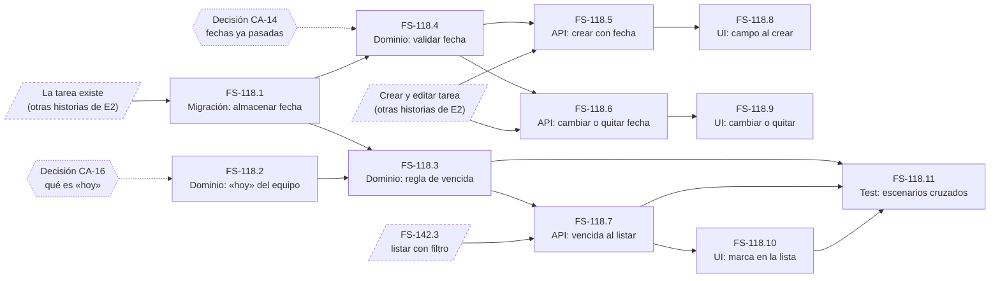
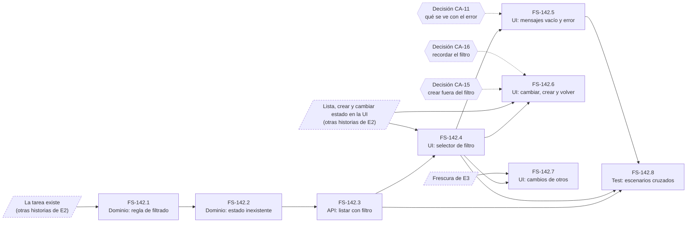

# Backlog del MVP de FlowSync

Backlog construido a partir del [PRD](../prd/flowsync-mvp.md) y de las historias de E2 «Gestión de tareas». Reúne los tickets de cada historia, sus dependencias, el orden de implementación y la priorización por impacto y complejidad.

- **Identificadores.** Solo **FS-118** y **FS-142** son identificadores oficiales, fijados por el equipo. Las demás historias llevan etiquetas de trabajo (H1, H2…, F1…) que **no** son identificadores y se sustituirán cuando se les asigne uno.
- **Sin horas.** No hay estimaciones en horas. La complejidad es relativa.
- **Detalle de cada historia.** Los criterios de aceptación están en [FS-118](./E2-gestion-tareas/us-fechas-vencimiento.md) y [FS-142](./E2-gestion-tareas/us-filtrar-por-estado.md). Los tickets, con más detalle, en [tickets de FS-118](./E2-gestion-tareas/tickets-fechas-vencimiento.md) y [tickets de FS-142](./E2-gestion-tareas/tickets-filtrar-por-estado.md).
- **Convención de los tickets.** Cada ticket hereda los criterios de su historia, que se citan por su número (CA-n). Su Definition of Done es solo «cómo lo entregamos» (pruebas, manejo de error, convenciones), sin criterios nuevos. Nombra la capa que toca, pero no diseña.

---

## 1. Tickets de FS-118: Fecha de vencimiento y tareas vencidas

FS-118 agrupa la fecha de vencimiento (poner, cambiar y quitar) y las tareas vencidas. No hay tickets de tipo Bug.

### Dependencias externas de FS-118

- **Que la tarea exista.** Crear, listar, editar, cambiar de estado y archivar tareas, y la vista de archivadas. Son otras historias de E2, sin identificador asignado todavía.
- **FS-142.3.** El listado con filtro por estado. Lo necesita CA-19.
- **Ejecutor de pruebas del frontend.** Hoy no hay ninguno. Es el trabajo habilitador del PRD, sin identificador asignado.
- **Decisiones abiertas** de la historia: CA-14, CA-16 y CA-17.

### FS-118.1: Almacenar la fecha de vencimiento de la tarea
- **Tipo:** Migración/DB
- **Capa:** migración de base de datos.
- **Hereda:** CA-1, CA-2, CA-4, CA-5, CA-6.
- **Definition of Done:**
  - [ ] La migración se aplica y se deshace sin error sobre una base limpia.
  - [ ] Las tareas que ya existían siguen intactas.
  - [ ] El esquema generado se regenera con la migración y se commitea, sin editarlo a mano.
  - [ ] Sigue la convención de nombres de las migraciones existentes.
- **Depende de:** la tarea existe (externo). Si esa historia aún no ha creado la tabla, conviene coordinar para no hacer dos migraciones donde basta una.

### FS-118.2: Definir qué es «hoy» para el equipo
- **Tipo:** Modelo/Dominio
- **Capa:** lógica de dominio.
- **Hereda:** CA-11 y CA-16.
- **Definition of Done:**
  - [ ] «Hoy» se calcula en un solo sitio, que el resto de las reglas reutiliza.
  - [ ] Pruebas unitarias para CA-11 (el mismo día no es vencida, el siguiente sí) y para CA-16 (dos personas, mismo resultado).
  - [ ] Las pruebas controlan la hora y no dependen del reloj real.
  - [ ] Lint y comprobación de tipos pasan.
- **Depende de:** ninguno técnico. **Bloqueado por la decisión de CA-16** (una zona del equipo o la de cada persona).

### FS-118.3: Regla de «vencida»
- **Tipo:** Modelo/Dominio
- **Capa:** lógica de dominio.
- **Hereda:** CA-3, CA-7, CA-8, CA-9, CA-10, CA-12 y CA-13.
- **Definition of Done:**
  - [ ] Cada criterio heredado tiene al menos una prueba unitaria con su DADO/CUANDO/ENTONCES.
  - [ ] Se prueba que «vencida» no cambia el estado de la tarea (CA-12).
  - [ ] Se prueba el paso a «hecho» y la reapertura (CA-9 y CA-10).
  - [ ] La regla vive en el modelo y no en controladores.
  - [ ] Usa los alias de importación del proyecto.
  - [ ] Lint y comprobación de tipos pasan.
- **Depende de:** FS-118.1 y FS-118.2. CA-13 necesita además que exista el archivado (externo).

### FS-118.4: Validar la fecha al guardarla
- **Tipo:** Modelo/Dominio
- **Capa:** lógica de dominio y validación.
- **Hereda:** CA-15 y CA-14.
- **Definition of Done:**
  - [ ] Una fecha inexistente, como el 31 de febrero, se rechaza con un mensaje en castellano, y la tarea conserva su fecha anterior.
  - [ ] Una fecha pasada se trata como decida CA-14, con pruebas para el caso aceptado y para el rechazado.
  - [ ] Los validadores siguen el estilo de los existentes.
  - [ ] Lint y comprobación de tipos pasan.
- **Depende de:** FS-118.1. **CA-14 está bloqueado por su decisión** (permitir o rechazar fechas ya pasadas).

### FS-118.5: Crear una tarea con fecha de vencimiento opcional
- **Tipo:** Endpoint/API
- **Capa:** endpoint, ampliando el de crear tarea.
- **Hereda:** CA-1, CA-2 y CA-14.
- **Definition of Done:**
  - [ ] Una prueba funcional por cada criterio heredado.
  - [ ] La respuesta pasa por el transformer, con el envoltorio común.
  - [ ] Los errores de validación llegan en castellano y por campo.
  - [ ] Exige sesión iniciada.
  - [ ] Las pruebas aíslan la base de datos para no ensuciar la de desarrollo.
  - [ ] Los tipos generados del cliente se regeneran y se commitean.
  - [ ] Lint y comprobación de tipos pasan.
- **Depende de:** FS-118.4 y el endpoint de crear tarea (externo).

### FS-118.6: Cambiar o quitar la fecha de una tarea existente
- **Tipo:** Endpoint/API
- **Capa:** endpoint, ampliando el de editar tarea.
- **Hereda:** CA-4, CA-5, CA-6, CA-15 y CA-18.
- **Definition of Done:**
  - [ ] Una prueba funcional por cada criterio heredado.
  - [ ] Cualquier miembro puede modificar la fecha de cualquier tarea activa, sin pedir justificación (CA-18).
  - [ ] Los errores de validación llegan en castellano y por campo.
  - [ ] Exige sesión iniciada.
  - [ ] Las pruebas aíslan la base de datos.
  - [ ] Los tipos generados del cliente se regeneran y se commitean.
  - [ ] Lint y comprobación de tipos pasan.
- **Depende de:** FS-118.4 y el endpoint de editar tarea (externo).

### FS-118.7: Informar de la condición de vencida al listar
- **Tipo:** Endpoint/API
- **Capa:** endpoint, ampliando el de listar tareas y el de archivadas.
- **Hereda:** CA-3, CA-7, CA-8, CA-13 y CA-19.
- **Definition of Done:**
  - [ ] Una prueba funcional por cada criterio heredado.
  - [ ] La condición de vencida y la fecha salen en cada tarea, vía el transformer.
  - [ ] Se prueba que sigue saliendo al filtrar por estado (CA-19).
  - [ ] Todos los miembros reciben el mismo resultado para la misma tarea.
  - [ ] Las pruebas aíslan la base de datos.
  - [ ] Los tipos generados del cliente se regeneran y se commitean.
  - [ ] Lint y comprobación de tipos pasan.
- **Depende de:** FS-118.3, el endpoint de listar (externo) y FS-142.3 para CA-19.

### FS-118.8: Campo de fecha en el formulario de crear tarea
- **Tipo:** Frontend
- **Capa:** interfaz de usuario.
- **Hereda:** CA-1, CA-2, CA-14 y CA-15.
- **Definition of Done:**
  - [ ] La fecha es opcional: no se pide nada más para crear sin ella.
  - [ ] Los errores de campo se muestran con su mensaje en castellano.
  - [ ] Toda llamada a la API pasa por el módulo único de acceso a la API.
  - [ ] Usa componentes de la librería de interfaz ya instalados, sin editarlos a mano.
  - [ ] La compilación con comprobación de tipos, el lint y el formateo pasan.
  - [ ] Pruebas automáticas si ya hay ejecutor. Si no, comprobación manual de CA-1, CA-2 y CA-15 anotada en el ticket.
- **Depende de:** FS-118.5 y el formulario de crear tarea (externo).

### FS-118.9: Cambiar o quitar la fecha desde una tarea existente
- **Tipo:** Frontend
- **Capa:** interfaz de usuario.
- **Hereda:** CA-4, CA-5, CA-6, CA-15 y CA-18.
- **Definition of Done:**
  - [ ] Se puede poner, cambiar y quitar la fecha sin pasos extra ni justificación.
  - [ ] Los errores de campo se muestran en castellano, y la fecha anterior se conserva si falla.
  - [ ] Toda llamada a la API pasa por el módulo único de acceso a la API.
  - [ ] La compilación con comprobación de tipos, el lint y el formateo pasan.
  - [ ] Pruebas automáticas si ya hay ejecutor. Si no, comprobación manual anotada en el ticket.
- **Depende de:** FS-118.6 y la edición de tareas en la interfaz (externo).

### FS-118.10: Mostrar la fecha y la marca de vencida en la lista
- **Tipo:** Frontend
- **Capa:** interfaz de usuario.
- **Hereda:** CA-1, CA-3, CA-7, CA-8, CA-9, CA-10, CA-12, CA-13 y CA-19.
- **Definition of Done:**
  - [ ] La marca de vencida se distingue sin depender solo del color.
  - [ ] El estado de la tarea se sigue viendo igual (CA-12).
  - [ ] La marca se mantiene al filtrar (CA-19) y se ve la fecha, sin marca, en archivadas (CA-13).
  - [ ] La compilación con comprobación de tipos, el lint y el formateo pasan.
  - [ ] Pruebas automáticas si ya hay ejecutor. Si no, comprobación manual de cada criterio anotada en el ticket.
- **Depende de:** FS-118.7, y de la lista en la interfaz (externo).

### FS-118.11: Pruebas de aceptación de los escenarios que cruzan capas
- **Tipo:** Test
- **Capa:** pruebas de extremo a extremo.
- **Hereda:** CA-10, CA-11, CA-16 y CA-9, los que dependen del tiempo y del estado a la vez.
- **Definition of Done:**
  - [ ] Cada escenario está escrito con su DADO/CUANDO/ENTONCES.
  - [ ] Las pruebas son deterministas: controlan el «hoy» y no dependen del reloj real.
  - [ ] Son independientes del orden y aíslan la base de datos.
  - [ ] Pasan en local con el comando de pruebas del proyecto.
- **Depende de:** FS-118.3, FS-118.7 y FS-118.10.

### Grafo de dependencias de FS-118

Las flechas van del ticket bloqueante al bloqueado. Los nodos con borde discontinuo son dependencias externas a FS-118. Los rombos son decisiones abiertas: bloquean el cierre del ticket, no su inicio.

| Ticket | Lo bloquea |
|---|---|
| FS-118.1 | la tarea existe (externo) |
| FS-118.2 | decisión CA-16 |
| FS-118.3 | FS-118.1, FS-118.2 (y el archivado, externo, para CA-13) |
| FS-118.4 | FS-118.1, decisión CA-14 |
| FS-118.5 | FS-118.4 y crear tarea (externo) |
| FS-118.6 | FS-118.4 y editar tarea (externo) |
| FS-118.7 | FS-118.3, listar (externo) y FS-142.3 |
| FS-118.8 | FS-118.5 |
| FS-118.9 | FS-118.6 |
| FS-118.10 | FS-118.7 |
| FS-118.11 | FS-118.3, FS-118.7, FS-118.10 |

### Orden de implementación de FS-118

Cada ola puede hacerse en paralelo dentro de sí misma.

0. **Antes de empezar:** que existan las tareas y sus endpoints de crear, editar y listar (externo), y cerrar las decisiones de CA-16 y CA-14.
1. **FS-118.1** y **FS-118.2**.
2. **FS-118.3** y **FS-118.4**.
3. **FS-118.5**, **FS-118.6** y **FS-118.7**. La última necesita además FS-142.3.
4. **FS-118.8**, **FS-118.9** y **FS-118.10**.
5. **FS-118.11**.

**Camino crítico:** FS-118.2, FS-118.3, FS-118.7, FS-118.10 y FS-118.11. Son cinco tickets en serie, y la cadena depende de la decisión de CA-16 desde su primer eslabón.

**Notas:**
- **Cerrar CA-16 cuanto antes.** Es lo que bloquea el camino crítico entero. Si sigue abierta, se puede avanzar con FS-118.1 y toda la rama de escritura (118.4, 118.5, 118.6, 118.8, 118.9), pero la rama de lectura (118.2, 118.3, 118.7, 118.10) no se puede cerrar.
- **CA-17 no tiene ticket.** La propuesta mínima, que se vea vencida «al volver a cargar», la cubre FS-118.7 sin trabajo extra. Si se decide que debe verse sin recargar, aparece un ticket nuevo y depende de la frescura de E3.
- **Si hay que recortar,** el alcance dice que la fecha cae primero. Los tickets que sobrevivirían con solo «poner la fecha al crear» son FS-118.1, 118.4, 118.5 y 118.8, más lo mínimo de 118.3 y 118.7.

---

## 2. Tickets de FS-142: Filtrar las tareas por estado

**No hay ticket de Migración/DB.** El filtro trabaja con el estado que la tarea ya tiene, y CA-16 propone no guardar nada por persona. No hay tickets de tipo Bug.

### Dependencias externas de FS-142

- **Que la tarea exista.** Crear, listar, cambiar de estado y archivar tareas. Son otras historias de E2, sin identificador asignado todavía.
- **La frescura de E3** (ver los cambios de otros sin recargar), sin identificador asignado. La necesita CA-18.
- **Ejecutor de pruebas del frontend.** Hoy no hay ninguno. Es el trabajo habilitador del PRD, sin identificador asignado.
- **FS-118.** CA-9 habla de conservar «la marca de vencida». Si FS-118 no está hecha, no hay marca que conservar.
- **Decisiones abiertas:** CA-11, CA-15 y CA-16.

### FS-142.1: Regla de filtrado por estado
- **Tipo:** Modelo/Dominio
- **Capa:** lógica de dominio.
- **Hereda:** CA-1, CA-2, CA-3, CA-4, CA-5, CA-6, CA-7, CA-9 y CA-13.
- **Definition of Done:**
  - [ ] Cada criterio heredado tiene al menos una prueba unitaria con su DADO/CUANDO/ENTONCES.
  - [ ] Se prueba que filtrar por cada uno de los tres estados deja fuera a los demás, y que sin filtro salen todas las activas.
  - [ ] Se prueba que una tarea archivada no sale con ningún filtro ni sin filtro (CA-7).
  - [ ] Se prueba que filtrar no modifica ninguna tarea (CA-9).
  - [ ] La regla vive en el modelo y no en controladores.
  - [ ] Usa los alias de importación del proyecto.
  - [ ] Lint y comprobación de tipos pasan.
- **Depende de:** la tarea existe (externo). CA-7 necesita además que exista el archivado (externo).

### FS-142.2: Reconocer un estado que no existe
- **Tipo:** Modelo/Dominio
- **Capa:** lógica de dominio y validación.
- **Hereda:** CA-6, CA-10 y CA-13.
- **Definition of Done:**
  - [ ] Un estado que no es ninguno de los tres se detecta como error, con un mensaje en castellano que lista los estados válidos.
  - [ ] Hay una prueba que comprueba que ese caso **no** acaba en una lista vacía silenciosa.
  - [ ] Un filtro en blanco se trata como «sin filtro» y no como error (CA-13).
  - [ ] Los validadores siguen el estilo de los existentes.
  - [ ] Lint y comprobación de tipos pasan.
- **Depende de:** FS-142.1.

### FS-142.3: Listar las tareas activas con filtro opcional por estado
- **Tipo:** Endpoint/API
- **Capa:** endpoint, ampliando el de listar tareas.
- **Hereda:** CA-1, CA-2, CA-3, CA-4, CA-5, CA-7, CA-8, CA-9, CA-10, CA-12, CA-13 y CA-17.
- **Definition of Done:**
  - [ ] Una prueba funcional por cada criterio heredado.
  - [ ] Un estado inexistente devuelve un error en castellano y por campo, y una prueba demuestra que no devuelve una lista vacía (CA-10).
  - [ ] Un estado válido sin tareas se distingue del error (CA-12).
  - [ ] Dos miembros con el mismo filtro reciben el mismo resultado (CA-8).
  - [ ] Sin sesión iniciada no se devuelve ninguna tarea (CA-17).
  - [ ] La respuesta pasa por el transformer, con el envoltorio común.
  - [ ] Las pruebas aíslan la base de datos para no ensuciar la de desarrollo.
  - [ ] Los tipos generados del cliente se regeneran y se commitean.
  - [ ] Lint y comprobación de tipos pasan.
- **Depende de:** FS-142.1, FS-142.2 y el endpoint de listar (externo).

### FS-142.4: Selector de filtro por estado en la lista
- **Tipo:** Frontend
- **Capa:** interfaz de usuario.
- **Hereda:** CA-1, CA-2, CA-3, CA-4, CA-5, CA-6, CA-9 y CA-17.
- **Definition of Done:**
  - [ ] Las opciones son exactamente los tres estados, más quitar el filtro, y ninguno viene preseleccionado (CA-5 y CA-6).
  - [ ] Quitar el filtro devuelve todas las activas (CA-4).
  - [ ] Filtrar no cambia ninguna tarea ni su información visible (CA-9).
  - [ ] Sin sesión se sigue llevando a iniciar sesión (CA-17).
  - [ ] Toda llamada a la API pasa por el módulo único de acceso a la API.
  - [ ] Usa componentes de la librería de interfaz ya instalados, sin editarlos a mano.
  - [ ] La compilación con comprobación de tipos, el lint y el formateo pasan.
  - [ ] Pruebas automáticas si ya hay ejecutor. Si no, comprobación manual de cada criterio anotada en el ticket.
- **Depende de:** FS-142.3 y la lista en la interfaz (externo).

### FS-142.5: Mensajes de lista vacía y de estado inexistente
- **Tipo:** Frontend
- **Capa:** interfaz de usuario.
- **Hereda:** CA-10, CA-11 y CA-12.
- **Definition of Done:**
  - [ ] El aviso de estado inexistente sale en castellano, nombra los estados válidos y se ve claramente distinto del mensaje de lista vacía (CA-10 y CA-12).
  - [ ] Nunca se muestra «no hay tareas» ante un estado que no existe.
  - [ ] Lo que se ve junto al aviso sigue lo que se decida en CA-11, y la lista no se presenta como filtrada.
  - [ ] Los errores llegan con el mensaje ya traducido por el módulo de acceso a la API.
  - [ ] La compilación con comprobación de tipos, el lint y el formateo pasan.
  - [ ] Pruebas automáticas si ya hay ejecutor. Si no, comprobación manual anotada en el ticket.
- **Depende de:** FS-142.4. **Bloqueado por la decisión de CA-11.**

### FS-142.6: Comportamiento del filtro al cambiar o crear tareas y al volver
- **Tipo:** Frontend
- **Capa:** interfaz de usuario.
- **Hereda:** CA-14, CA-15 y CA-16.
- **Definition of Done:**
  - [ ] Cambiar el estado de una tarea con filtro activo la saca de la vista y deja el filtro puesto (CA-14).
  - [ ] Crear una tarea que no coincide con el filtro actúa como decida CA-15, con prueba o comprobación para el caso con aviso y para el caso sin él.
  - [ ] Al volver a abrir la lista, el filtro se comporta como decida CA-16 y, si se decide no recordarlo, no se guarda nada por persona.
  - [ ] La compilación con comprobación de tipos, el lint y el formateo pasan.
  - [ ] Pruebas automáticas si ya hay ejecutor. Si no, comprobación manual de cada criterio anotada en el ticket.
- **Depende de:** FS-142.4 y las acciones de crear y cambiar estado en la interfaz (externo). **Bloqueado por las decisiones de CA-15 y CA-16.**

### FS-142.7: Aplicar el filtro a los cambios que llegan de otros
- **Tipo:** Frontend
- **Capa:** interfaz de usuario.
- **Hereda:** CA-18.
- **Definition of Done:**
  - [ ] Cuando llega un cambio de otro miembro, la tarea aparece o desaparece según cumpla el filtro activo.
  - [ ] El plazo en que se ve lo fija E3, y este ticket no lo redefine.
  - [ ] El filtro sigue activo tras el cambio entrante.
  - [ ] La compilación con comprobación de tipos, el lint y el formateo pasan.
  - [ ] Pruebas automáticas si ya hay ejecutor. Si no, comprobación manual anotada en el ticket.
- **Depende de:** FS-142.4 y la frescura de E3 (externo).

### FS-142.8: Pruebas de aceptación de los escenarios que cruzan capas
- **Tipo:** Test
- **Capa:** pruebas de extremo a extremo.
- **Hereda:** CA-7, CA-8, CA-10 y CA-14, los que mezclan filtro con archivado, con varios miembros o con cambios de estado.
- **Definition of Done:**
  - [ ] Cada escenario está escrito con su DADO/CUANDO/ENTONCES.
  - [ ] Se cubre el estado inexistente de punta a punta, comprobando que nunca llega una lista vacía en silencio.
  - [ ] Son independientes del orden y aíslan la base de datos.
  - [ ] Pasan en local con el comando de pruebas del proyecto.
- **Depende de:** FS-142.3, FS-142.4 y FS-142.5.

### Grafo de dependencias de FS-142

Las flechas van del ticket bloqueante al bloqueado. Los nodos con borde discontinuo son dependencias externas a FS-142. Los rombos son decisiones abiertas.

### Orden de implementación de FS-142

1. **FS-142.1**, luego **FS-142.2**, luego **FS-142.3**, luego **FS-142.4**. Es una cadena en serie.
2. **FS-142.5**, **FS-142.6** y **FS-142.7**, en paralelo una vez hecho FS-142.4. Las tres tienen bloqueos propios: FS-142.5 espera la decisión de CA-11, FS-142.6 las de CA-15 y CA-16, y FS-142.7 la frescura de E3.
3. **FS-142.8**, al final.

**Notas:**
- **El camino mínimo,** si hay que recortar, es FS-142.1, 142.2, 142.3 y 142.4. Con eso ya se filtra por estado y se avisa del estado inexistente. Los demás tickets refinan la experiencia.
- **Decisiones que bloquean:** FS-142.5 espera a CA-11, y FS-142.6 a CA-15 y CA-16. Hasta que se resuelvan, pueden prepararse pero no cerrarse.

### Coordinación entre las dos historias

**FS-118.7 depende de FS-142.3.** Ambos amplían el mismo endpoint de listar. Conviene decidir quién va primero, para no pisarse. FS-118.7 ya declara FS-142 como dependencia, y el ticket concreto es FS-142.3.

---

## 3. Matriz de impacto y complejidad

### Cómo se ha puntuado

- **Impacto** es cuánto contribuye al trabajo central del PRD: ver qué está en curso y qué queda por coger, para dejar de preguntar «¿en qué estás?». También cuenta cuánto ayuda contra el riesgo #1, que la información se quede vieja.
- **Complejidad** es relativa: capas que toca, infraestructura que aún no existe en el repo, dependencias y decisiones abiertas. No son horas.
- **Confianza.** FS-118 y FS-142 están descompuestas en tickets, así que su complejidad está mejor fundada. El resto se ha puntuado **por analogía**, sin descomponer, y tiene menos confianza.
- **Etiquetas.** FS-118 agrupa la fecha de H3, las vencidas de H9 y la parte de fecha de H7. H7 queda solo con el título (H7′). Las etiquetas H y F son de trabajo, no identificadores.

### Historias de E2 y el sync de E3

| Etiqueta | Historia | ¿Dentro del MVP? |
|---|---|---|
| H1 | Ver la lista compartida | Sí |
| H2 | Crear tarea (título y responsable) | Sí |
| FS-118 | Fecha de vencimiento y tareas vencidas | Sí |
| H4 | Cambiar el estado en dos clics | Sí |
| H5 | Devolver una tarea de «hecho» a otro estado | Sí, sobre un `[SUPUESTO]` |
| H6 | Cambiar el responsable | Sí, sobre un `[SUPUESTO]` |
| H7′ | Corregir el título | Sí, sobre un `[SUPUESTO]` |
| FS-142 | Filtrar por estado | Sí |
| H10 | Archivar una tarea | Sí |
| H11 | Mensaje opcional al archivar | Sí |
| H12 | Vista de archivadas | Sí |
| E3 | Frescura de 5 a 10 segundos | Sí |
| E3 | Sync en tiempo real estricto | **Fuera** |
| F1 | Borrar una tarea | **Fuera** |
| F2 | Restaurar una tarea archivada | **Fuera** |
| F3 | Estado «bloqueado» | **Fuera** |
| F4 | Tarea sin responsable | **Fuera** |
| F5 | Prioridad, etiquetas, subtareas y adjuntos | **Fuera** |
| F6 | Comentarios en tareas | **Fuera** |
| F7 | Estimar o asignar a un sprint | **Fuera** |
| F8 | Estados configurables | **Fuera** |
| F9 | Importar tareas desde otro gestor | **Fuera** |

### Matriz

| Impacto ↓ / Complejidad → | **Baja** | **Media** | **Alta** |
|---|---|---|---|
| **Alto** | ⭐ **H4** Cambiar estado en dos clics ⭐ **H6** Cambiar responsable | **H1** Ver la lista compartida **H2** Crear tarea *F3 Estado «bloqueado» (fuera)* | **E3 Frescura 5-10 s** (dentro) |
| **Medio** | *F4 Tarea sin responsable (fuera)* ⚠ | **FS-142** Filtrar por estado **H10** Archivar | **FS-118** Fecha y vencidas *F6 Comentarios (fuera)* *F9 Importar de otro gestor (fuera)* |
| **Bajo** | **H5** Reabrir una hecha **H7′** Corregir título **H11** Mensaje al archivar | **H12** Vista de archivadas *F1 Borrar tarea (fuera)* *F2 Restaurar archivada (fuera)* | *E3 Sync en tiempo real estricto (fuera)* *F5 Prioridad, etiquetas, subtareas, adjuntos (fuera)* *F7 Estimar o sprints (fuera)* *F8 Estados configurables (fuera)* |

⭐ marca un quick win (alto impacto, baja complejidad). Lo que va en cursiva está **fuera del MVP**.

### Justificación de las posiciones menos obvias

- **H1 y H2 (impacto alto, complejidad media):** sin ellas no existe nada más. Son los primeros de su tipo en el repo (primeras pruebas, primeras pruebas funcionales, primera migración de tareas), y de ahí la complejidad media.
- **H4 (quick win):** es *la* señal del producto, «en curso». Una vez que existen H1 y H2, es una sola operación sobre una tarea.
- **H6 (quick win, con matiz):** es el mínimo de RF-10, que descansa sobre un `[SUPUESTO]`. Cambiar el responsable es cómo se «coge» una tarea de otro. Es barata si H1 y H2 ya existen.
- **FS-142:** impacto medio porque la lista ya muestra el estado de cada tarea y el filtro solo ayuda a centrarse. Su camino mínimo (FS-142.1 a 142.4) es barato. Lo que sube la complejidad son los tickets que esperan decisiones.
- **FS-118:** 11 tickets, tiempo y husos horarios, y un ticket de pruebas de extremo a extremo. Impacto medio, porque no es la señal central y el alcance ya dice que cae primero si hay que recortar.
- **E3 frescura (alto/alto):** ataca el riesgo #1, pero necesita un mecanismo que hoy no existe, con plazo, pestañas en segundo plano y filas que se mueven. Es la gran apuesta.
- **E3 sync en tiempo real estricto:** aporta casi lo mismo que la frescura de 5 a 10 s, porque con 3 husos horarios hay poco solape en directo, y cuesta bastante más. Por eso está fuera.
- **F3 bloqueado:** es el mayor valor que falta, porque es la mitad de la daily que el MVP no resuelve. Pero por sí solo vale poco sin un sitio donde explicar el bloqueo (F6).
- **F4 tarea sin responsable ⚠:** en la matriz parece un quick win, pero contradice una decisión tomada (responsable obligatorio). No se promueve sin reabrir esa decisión.
- **F9 importar:** el impacto depende de si re-teclear lo abierto es de verdad la barrera de adopción, y eso aún no se sabe.

---

## 4. Orden de backlog priorizado

**Fase 1: la lista usable de punta a punta** (el alcance dice que va antes que la frescura)
1. **H1** Ver la lista y **H2** Crear tarea. Son habilitadoras.
2. ⭐ **H4** Cambiar estado en dos clics.
3. ⭐ **H6** Cambiar responsable.
4. **FS-142** Filtrar por estado, empezando por el camino mínimo (FS-142.1 a 142.4).
5. **H10** Archivar, y después **H11** (mensaje) y **H12** (vista de archivadas) como un paquete.
6. Los baratos de bajo impacto, **H5** (reabrir) y **H7′** (título), cuando se toque el mismo endpoint, porque salen casi gratis.

**Fase 2: frescura**

7. **E3 Frescura de 5 a 10 s.** Antes que FS-118, por su impacto sobre el riesgo #1.

**Fase 3: lo recortable**

8. **FS-118** Fecha y vencidas. Va última a propósito: el PRD dice que cae primero si hay que recortar, aunque sigue dentro del alcance. Además, FS-118.7 depende de FS-142.3, así que no puede ir antes que el filtro.

**Puerta de validación**

9. Una semana de uso real, con un equipo real. Después de eso, y solo con evidencia:
   - **F3 y F6** (bloqueado y comentarios), como pareja, si los bloqueos siguen obligando a hacer la daily.
   - **F2** (restaurar), si hay archivados por error.
   - **F9** (importar), si el coste de empezar de cero resulta ser el freno.
   - **F4** (sin responsable), solo si se reabre esa decisión.

**No planificar:** F1 (borrar), F5, F7, F8 y el sync en tiempo real estricto. Cuestan más de lo que aportan a este usuario, o contradicen lo que el producto quiere ser.

### Quick wins

- ⭐ **H4** Cambiar estado en dos clics.
- ⭐ **H6** Cambiar responsable.

Son pocos y dependen de H1 y H2: son baratos *una vez que existe la lista y la creación*. Antes no hay nada sobre lo que cambiar un estado o un responsable.

### A tener en cuenta

- **Frescura, antes o después de archivar y filtrar.** El orden sigue el del alcance (la lista primero). Si se prefiere validar antes el riesgo #1, la frescura sube, pero arrastra su coste y sus decisiones abiertas.
- **Las dependencias externas** (la tarea, crear, editar, listar y archivar) no están descompuestas aquí, y podrían pesar más que FS-118 entera.
